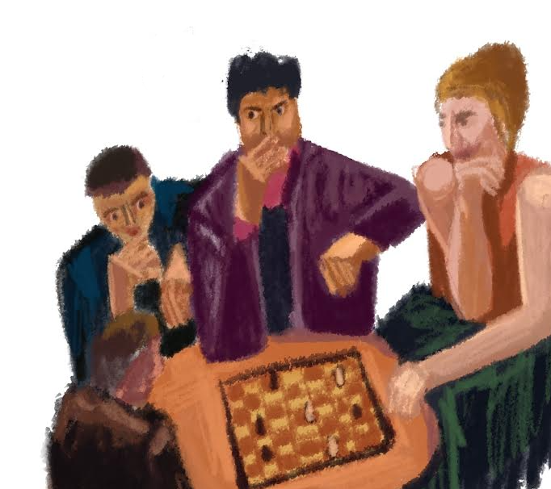

```{r setup, include=FALSE}
knitr::opts_chunk$set(echo = FALSE)
library(tidyverse)
library(skimr)
```



## Choosing sides: White vs Black advantage

Considering the two-player nature of chess, it is intuitive that players need to play as either white or black. Although this may appear as a  minute detail, it is nevertheless important to consider that the rules of chess allows white to make the first move. Now, we see the conundrum such that if white gets to make the first move, they may be better able to control the most crucial position of the chess board: the center four squares. This early monopoly of the board (and clever game play, of course) may ultimately lead to a white win. We can test this advantage by exploring data from online chess games (see https://www.kaggle.com/datasnaek/chess)

```{r winning advantge, echo=FALSE}
games <- read_csv("games.csv")
#selecting variables of interest 
games_winner<- games %>% select("rated", turns, "victory_status", "winner", white_rating, black_rating)
# QUESTION 1: Answering question of whether black or white wins more often
games_winner %>% count(winner)
#remove data containing games ending in "draws" as it is not of interest and plot
games_winner <- games_winner %>% filter(winner %in% c("black","white"))
ggplot(games_winner, aes(winner))+geom_bar()+
  xlab("Side") +
  ylab ("Winning count") +
  ggtitle("Which side wins more often")
```

As speculated, white appears to generellay have more wins than black. However, there are different ways to win in chess specifically by checkmating or having your opponent resign. Let us investigate what are common victory statuses associated with a white or black win?

```{r victory status, echo=FALSE}
games_status<-games_winner  %>% count(victory_status, winner) %>% filter(victory_status %in% c("mate", "resign"))
ggplot(games_status, aes(winner,n))+geom_col(aes(fill=victory_status), position ="dodge") +
  xlab("Side") +
  ylab ("Winning count") +
  ggtitle("Victory status associated with black and white side")
```

It is interesting to note that victory status patterns are similar between black and white such that it is more likely for the opponent to resign than to lose by mate. This eludes to the difficulty of winning by mate and also to the fact that online games are more susceptible to resignation of players due to lesser repercussion and investment in games.Overall, although white appears to have an advantage over black in terms of wining, both sides may be more likely to win by having opponents resigns in the world of online chess. 

## Winning quick!
The graceful game of chess can be won swiftly, but how many turns does it take to win?

```{r least_turns, echo=FALSE}
least_turns<-games %>% filter(turns < 2)
least_turns %>% count(turns)
```
It appears that a total of 18 games were won in one turn. However, this is theoretically and practically impossible considering that no first move eitehr bfrom black or white has the power to put the opponent in checkmate. Therefore, with a little more investigating we notice that winning on the forst move applies only to online games as players either "resign" (leave) the game or run out of time in making a move. 
```{r, echo=FALSE}
least_turns %>% count(turns, victory_status)
```
This demonstrates that neither black nor white won by chess expertise but merely due to the behavior of their opponent. We now find ourselves asking, in the conditin of a checkmate, what are the least number of turns taken to achieve this victory_status?

```{r, echo=FALSE}
least_turns_mate <- games %>% filter(victory_status=="mate") %>% arrange(turns) 
least_turns_mate %>% count(turns,victory_status)

```
It appears possible to win in just 4 moves! However, what other charactheristice does a win in 4 moves player posses? 
```{r, echo=FALSE}
least_turns_mate<-least_turns_mate%>% filter(turns==4)
least_turns_mate %>% count(turns,victory_status, winner, opening_name)
```
Interestingly, we find that unlike previous accounts, black posseses the advantage of winning (by mate) in just 4 moves especially with the Bird opening!

## Player rating

We have thus far considered the characteristics of the game in contributing to a winner, but what about the characteristics of the player themselves? Most crucially, we ask wetehr player ratings correlate with winning (by mate) fast. 
```{r,echo=FALSE}
ratings <- games %>% filter(victory_status=="mate")
ratings_white<-ratings %>% filter(winner=="white")
ggplot(ratings_white,aes(white_rating,turns))+geom_smooth() + ggtitle("White rating and turns taken to win by mate")
ratings_black<-ratings %>% filter(winner=="black")
ggplot(ratings_black,aes(black_rating,turns))+geom_smooth() + ggtitle("Black rating and turns taken to win by mate")
```
It appears that as black_ratings increase (implying greater expeirnce and skill), the number of turns taken to checkmate increases. Meanwhile as white ratings increase the number of turns taken to win generally decreases but there is increases variability in average rated players. This perhaps once again eludes to the white advantage as discussed previously. let's now take into account most common openings moves used by white and black
```{r, echo=FALSE}
ratings_white%>%count(opening_name) %>% arrange(desc(n))
ratings_black%>%count(opening_name) %>% arrange(desc(n))
```
It appears that whites commonly use the Scandinavian Defense: Mieses-Kotroc Variation opening to win  by mate and black commonly use the Van't Kruijs Opening to win by mate. How then does player rating interact with these openings strategies? 
```{r, echo=FALSE}
opening_white<- games %>% filter (victory_status=="mate")
opening_white<-opening_white %>% filter(opening_name=="Scandinavian Defense: Mieses-Kotroc Variation")
opening_white<-opening_white %>% filter(winner=="white")
ggplot(opening_white, aes(white_rating, turns)) +geom_smooth() + ggtitle("White rating and turns taken to win by mate with the Scandinavian Defense: Mieses-Kotroc Variation")
opening_black2<- games %>% filter (victory_status=="mate")
opening_black2 <- games %>% filter(str_detect(opening_name, "Kruijs"))
opening_black2<-opening_black2 %>% filter(winner=="black")
ggplot(opening_black2, aes(black_rating, turns)) +geom_smooth() + ggtitle("Balck rating and turns taken to win by mate with the  Van’t Kruijs Opening")
```
With the Scandinavian Defense: Mieses-Kotroc Variation, it appears that your are more likely to win by mate quick with a higher rating (expeirnce). This is similar to black whereby when the Van’t Kruijs Opening was used, higher rated players wim quicker. Interestingly, however it seems that for both white and black, there is increased variation in number of turns between very low rated and very high rated players. SO if you are a very high rated or very low rated player, you can use these opening moves but there is increased risk of winning really slow. 

## Summary: Increasing your odds of winning 

1) Pick the white side! 

2) But don't fret if playing black, you may win quicker with the Bird Opening

3) If you are playing white, you can win quicker after practice and experience but as a beginner you may need to stick around for a while to earn a win (especially if you use theScandinavian Defense: Mieses-Kotroc Variation )

4) If you are playing black and use the Van't Kruijs Opening as a beginner, you run the risk of playing for a long time until you win. So if winning fast is priority, use this opening move as average or advanced player. 